# 🎯 DartsZentrale

**🇬🇧 English | [🇩🇪 Deutsch](README.md)**

**The free club and scoring app for darts clubs.** Score games, training modes,
leagues with automatic tables, teams, events, statistics and user management —
all in one place, on your own device or server.

[](https://github.com/zelko2k1/dartszentrale/releases/latest)
[](LICENSE)


> **Note on language:** The **app is fully bilingual (German/English)** — switch in
> Settings → Appearance, per device. All step-by-step guides are available in **English**
> (in [`docs/`](docs/)) and **German** (in [`docs/de/`](docs/de/)).

## ⬇️ Download & get started

### ▶️ **[Try the demo right in your browser](https://zelko2k1.github.io/dartszentrale/)** — nothing to install
*(Pick "Local" on first start — counter, training games and statistics run entirely in your browser.)*

### 👉 **[Download the ready-made package (latest release)](https://github.com/zelko2k1/dartszentrale/releases/latest)**

No expertise needed: download, unzip, double-click the start file. Which one fits?

| Package | Who is it for? |
|---|---|
| **`01-single-board.zip`** | One PC/tablet at the board — just scoring & training, no server, no sign-in. **← easiest start** |
| **`02-club-lan.zip`** | The whole club on your own network — one program serves the app **and** the database. |
| **`03-club-cloud.zip`** | Running on your own internet server with domain & HTTPS. |

The matching step-by-step guide is **inside the package** (English and German) and under
[“Getting started”](#getting-started--which-guide-fits-me) below.

---

## What is this — in plain words?

DartsZentrale is an app that covers a darts club's entire everyday life:

- **Score at the board** instead of chalk and slate — with checkout suggestions and live statistics.
- **Training games** like Cricket, Around the Clock or Bob's 27 with leaderboards.
- **Organise league play** — import the schedule, enter results, the table computes itself.
- **Manage teams & line-ups** and send them straight “to the boards”.
- **Statistics** for every player (3-dart avg, 180s, checkout rate, records …).
- **User accounts with roles**, so not everyone can change everything.

You need **no cloud company and no monthly fee**. The app runs entirely on a single PC
at the board, on your own club network, or on your own internet server — you decide.
Your members' data stays with you.

> ### Honestly: who is behind this?
> I am a **club admin, not a trained developer**. DartsZentrale grew out of a concrete
> need in our club and was **built with AI assistance (Anthropic Claude)** — from the first
> line to the docs. I'd rather say that openly than pretend it comes from years of
> professional development experience.
>
> **What that means for you:** I maintain the project and test it in real club play, but I
> cannot deeply evaluate every code path. **Code reviews, hints and pull requests are
> explicitly welcome.** Support is limited. Use **at your own risk, without warranty**
> (see [LICENSE](LICENSE)). The app manages **personal member data (GDPR)** — anyone
> self-hosting it should do so deliberately and carefully. The current security state and a
> go-live checklist are in [`docs/security-audit.md`](docs/security-audit.md) (German).

---

## Screenshots

| Dashboard | Darts Counter | Training games |
|:--:|:--:|:--:|
| 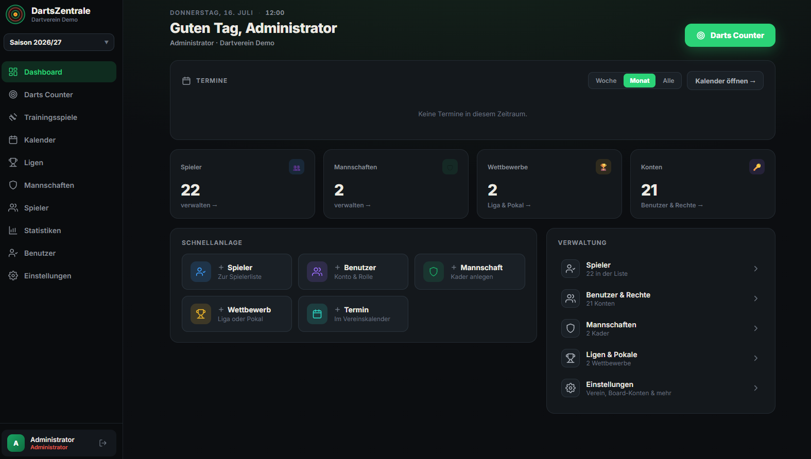 | 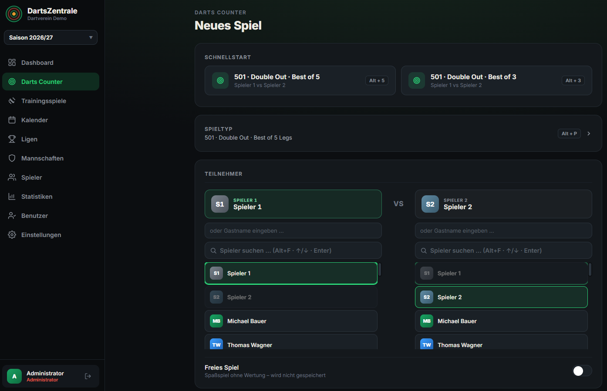 | 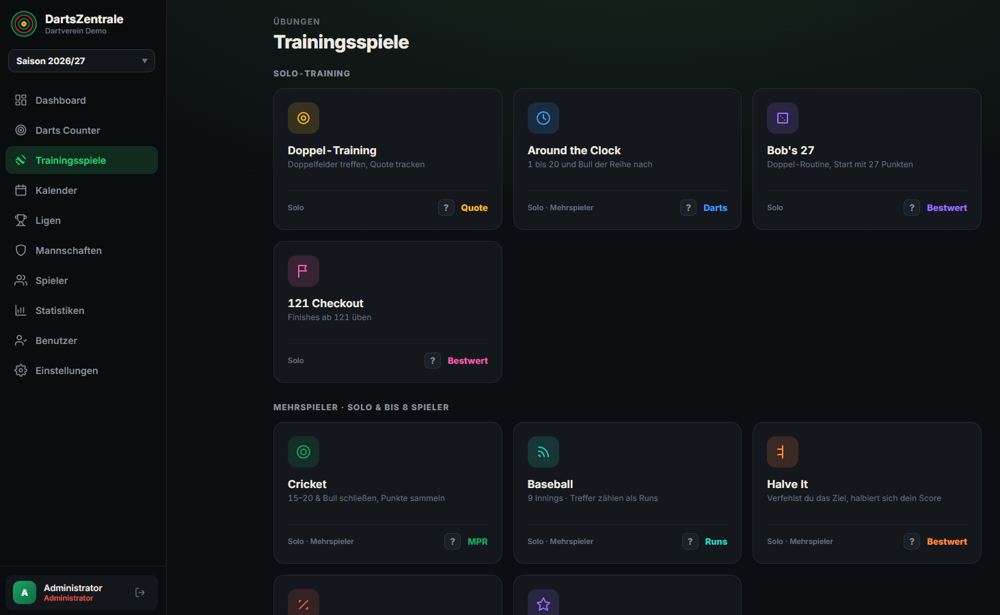 |
| **Calendar** | **Leagues** | **Teams** |
| 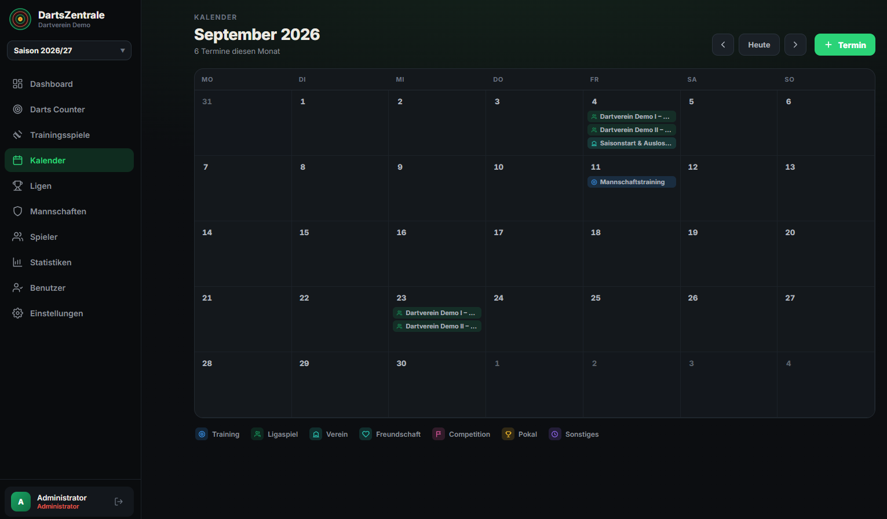 | 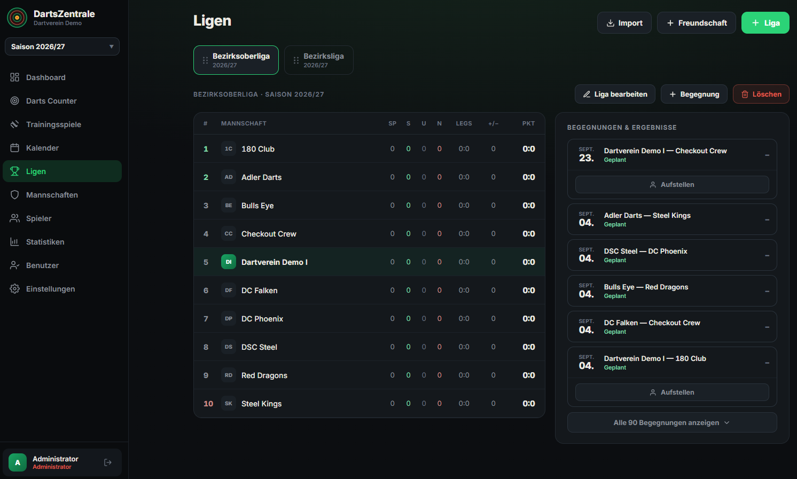 | 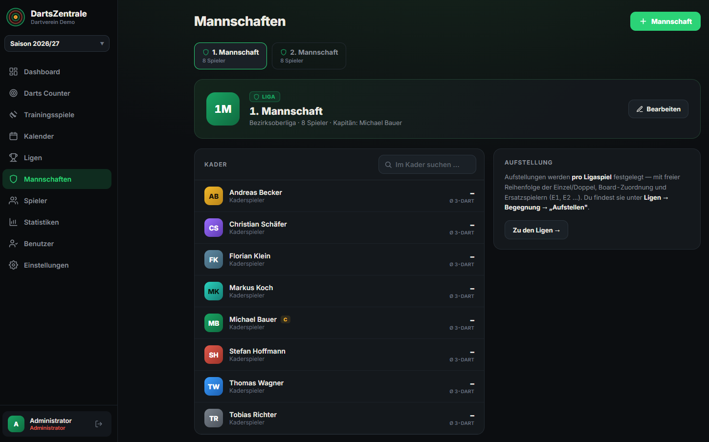 |
| **Players** | **Statistics** | **Users & roles** |
| 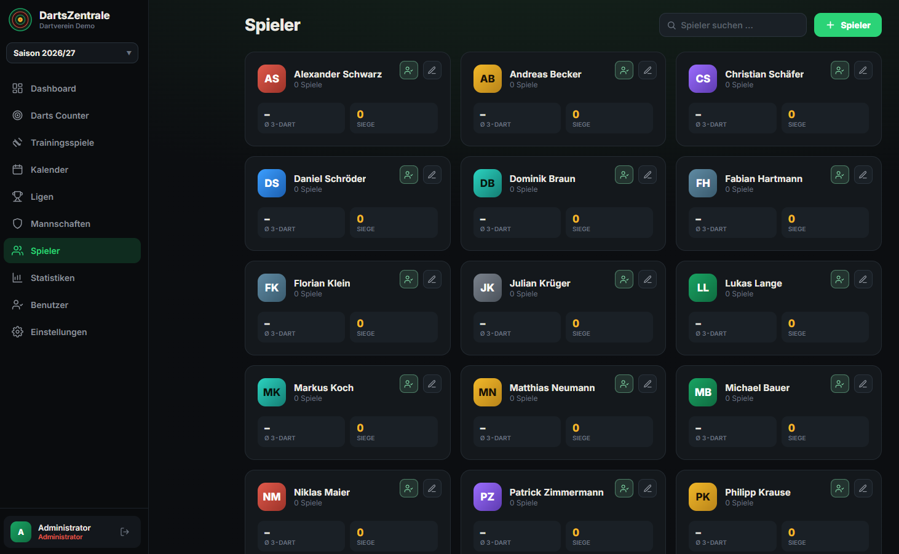 | 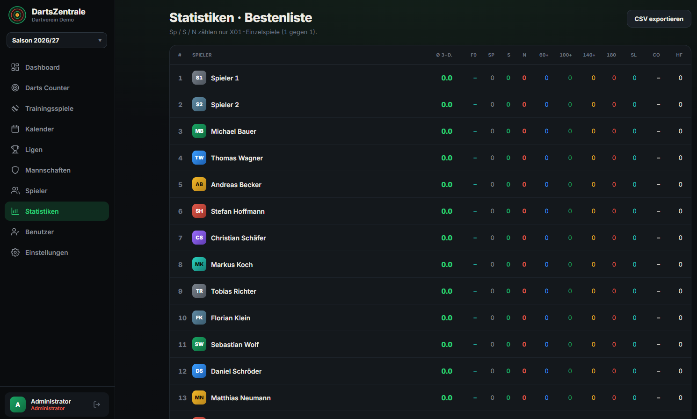 | 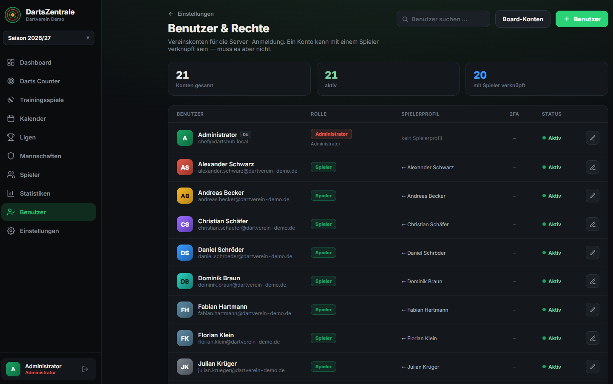 |
| **Settings** | **Board: “Next game”** | |
| 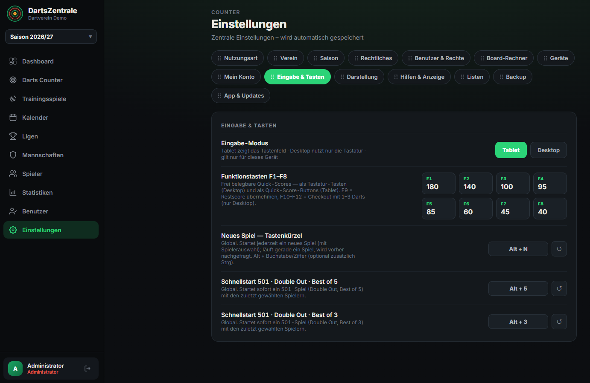 | 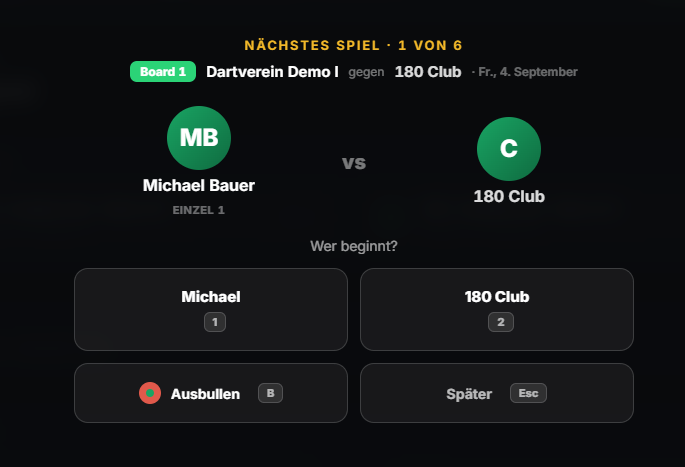 | |

*(Screenshots from club mode with demo data, German UI; the board overlay comes from the kiosk view of a board account.)*

---

## What the app can do

### 🎯 Play & score (Darts Counter)
- **X01 games** with starting scores 301 / 501 / 701 / 1001
- Checkout modes **single / double / master out**, optional **double in**
- Scoring by **legs** (best of 1–11) or by **sets**
- **Throw-off** via bull-off, random or manual choice
- **Guest players** (just type a name) and **free play** (does not count towards statistics)
- Input via **tablet keypad or keyboard**, freely assignable quick scores (F1–F8), checkout with 1/2/3 darts
- **Checkout suggestions** (finishing routes up to 170), **undo**, bust detection
- **Live stats** per player: 3-dart avg, first 9, 180/140+, checkout rate, high finish
- Two views: **“big number”** (readable from afar at the board) or **“score sheet”** in the classic style
- **Rematch** with one click; finished games are saved automatically with all detail values

### 🏋️ Training games (9 modes, complete)
- **Solo:** doubles training, Around the Clock, Bob's 27, 121 Checkout
- **Multiplayer (up to 8):** Around the Clock, Cricket (with MPR), Baseball, Halve It, Elimination, Killer — Cricket, Baseball & Halve It also work **solo**
- Every mode with a rules dialog, leaderboard, undo and rematch; most-played modes as quick starts

### 👥 Club management
- **Players** with avatar colour, initials and (in club mode) **profile photo**
- **Teams** as league, cup or friendly teams — with squad, captain and up to 2 vice-captains
- **User accounts** with a role, optional link to a player profile, active/inactive switch
- **Club identity:** club name and logo (scaled automatically), logo size on the login page
- **Legal texts** (legal notice & privacy policy) — reachable from the login page without signing in
- **Quick create** for player / user / team / competition / event straight from the admin dashboard

### 🏆 Leagues & competitions
- **Leagues, cups and friendlies** as separate competitions
- **Match-format templates** or a freely configurable block sequence
- **Automatic table** (P/W/D/L/difference/points), own team highlighted
- **Matches** with date, time, location and result
- **Line-up per matchday:** order singles/doubles freely, assign players, **assign boards**, substitute list, “send to the boards”
- **Match report** board by board, with **highlights** (180s, short legs, high finish)
- **Schedule import (CSV):** recognises the German BDV export format, creates table, matches and calendar events — **repeatable without duplicates**
- **nuLiga import:** pull table & matchdays straight from a **nuLiga group URL** (server-side fetch, admin only) — your own home results stay authoritative (differences are flagged as **conflicts**, never overwritten)

### 🖥️ Board & kiosk mode (club mode only)

Turns a PC at the board into a **self-sufficient match computer** — ideal for league night:

- **Board computer as kiosk:** the board PC signs in with its own **numbered board account** — the app then runs automatically **locked** in kiosk mode: only **Game · Training · Settings**, no access to administration. Unlocking requires an admin/captain login; after a restart the board is locked again.
- **The next game appears automatically:** when a board is assigned a match in the **line-up**, the board shows a **full-screen “Next game”** overlay with the pairing — the throw-off can be chosen right there (who starts · bull-off · later). The singles/doubles run **one after another**, and every result is written back into the **match report** automatically.
- **When it is shown:** within a configurable **window** around the matchday (matchday only up to ±3 days) — or immediately via **“send to the boards now”**.
- **Readable from a distance:** dedicated **board zoom** for long viewing distances.
- **Add devices via QR:** a QR code shows the **server address** — tablets/phones scan it, a board PC saves it as a kiosk bookmark; then sign in on the device with its **board account**.

### 📅 Calendar
- Monthly view with colour-coded event types (training, league match, club, cup, friendly, other)
- Create/edit events, automatic league-match events from the schedule import, filtered by season

### 📊 Statistics
- **Leaderboard** of all players (3-dart avg, first 9, 60+/100+/140+/180, short legs, checkout rate, high finish) — **exportable as CSV**
- **Player detail page** with records, win rate, scoring history; switchable between all seasons and a single season

### 🔄 Season management
- Exactly **one active season** plus a readable archive of earlier seasons
- **Close a season:** freezes table & statistics as a snapshot, downloads a backup, creates the following season
- **Carry over the previous season** (clone teams/leagues without results) and **offload a season** (save space; statistics keep working from the snapshot)

### 🔐 Users, roles & security
- **Five roles with graded permissions:** administrator · captain · player · viewer (read-only) · board computer (machine account, may only play)
- **Two-factor authentication (2FA/TOTP)**, self-service — QR code, backup codes, admin reset
- **Login** via email + password (optionally with a 2FA code); own password changeable, inactive accounts are rejected

### 💻 Operating modes & tech
- **Bilingual interface:** German/English, switchable per device in Settings → Appearance
- **Appearance:** light/dark, accent colours, 5 fonts, many size controls, command palette (Ctrl+K), configurable shortcuts
- **Progressive Web App (PWA):** installable and **works offline**, update hint without forced restarts
- **Backup:** full export/import of all data as JSON; in local mode additionally an automatic daily backup

---

## The two operating modes

DartsZentrale can run in two ways. You choose on first start:

| | **Local** (one board) | **Club** (network/server) |
|---|---|---|
| **Who for?** | A single PC/tablet at the board | The whole club, multiple devices |
| **Sign-in?** | No | Yes, with users & roles |
| **Data lives …** | in the device's browser | in a central database (PocketBase) |
| **Shared use?** | No | Yes — all devices see the same data, live |
| **Includes** | counter, training, players, statistics | additionally leagues, teams, calendar, users, seasons |

More in [`WORKFLOWS.md`](WORKFLOWS.md) (German).

---

## Getting started — which guide fits me?

The step-by-step guides are available in English (German versions in [`docs/de/`](docs/de/)):

| I want to … | Guide |
|---|---|
| Run **just one board** on a PC (no server) | [`docs/guide-local-linux.md`](docs/guide-local-linux.md) · [`docs/guide-local-windows.md`](docs/guide-local-windows.md) |
| Run it **in the clubhouse/LAN** for several devices (one machine as server) | [`docs/admin-guide-lan-linux.md`](docs/admin-guide-lan-linux.md) · [`docs/admin-guide-lan-windows.md`](docs/admin-guide-lan-windows.md) |
| Run it **on the internet** with your own domain & HTTPS | [`docs/admin-guide-cloud.md`](docs/admin-guide-cloud.md) + [`docs/go-live-checklist-cloud.md`](docs/go-live-checklist-cloud.md) |
| Run it in a **homelab with Docker/Arcane** | [`docs/arcane-homelab-guide.md`](docs/arcane-homelab-guide.md) |
| **Use** the app day to day (as a club admin) | [`docs/manual.md`](docs/manual.md) |

---

## Contributing

Feedback, bug reports, ideas and pull requests are very welcome — precisely because this
project comes from a club, not from a developer's office. Please understand that I can only
respond to very deep code topics to a limited extent.

Details (dev environment, process, commit style) are in [`CONTRIBUTING.md`](CONTRIBUTING.md) (German).

**Translations welcome:** the UI language packs live in
[`app/src/i18n/`](app/src/i18n/) — `de.ts` is the source of truth, `en.ts` must provide the
same keys (TypeScript enforces this at build time). A further language is just one more file.

---

## For developers & contributors

> This section is for anyone who wants to look at the code or the project layout.
> **You don't need it for plain club use** — the download above and the guides under
> [“Getting started”](#getting-started--which-guide-fits-me) are enough.

**Run the app locally:** `cd app && npm install && npm run dev` (opens `http://localhost:5173`).
Frontend details are in [`app/README.md`](app/README.md).

**Scripts & tools:** the start/update/autostart/setup scripts live in [`scripts/`](scripts/).
Database and maintenance tools (password/2FA reset, season export/import, board accounts,
demo data) plus schema, hooks and the Docker files live under [`pocketbase/`](pocketbase/).

### Project layout — what lives where?

```
dartszentrale/
├─ app/            → The app itself (user interface). Source in app/src/
├─ pocketbase/     → Backend: database, login/roles, server logic, maintenance scripts, Docker
├─ scripts/        → Start/update/autostart/setup scripts (flat in the download packages)
├─ docs/           → All guides and plans — English in docs/, German in docs/de/
├─ tools/          → Small helpers (e.g. read a schedule from a PDF)
├─ screenshots/    → Screenshots for the README
├─ spikes/         → Experiments (not in use yet)
└─ backup/ updates/→ Storage for backups and update packages
```

**Key files in the root folder:**

| File | Purpose |
|---|---|
| [`LICENSE`](LICENSE) | The MIT licence (free to use). |
| [`CONTRIBUTING.md`](CONTRIBUTING.md) · [`CODE_OF_CONDUCT.md`](CODE_OF_CONDUCT.md) · [`CHANGELOG.md`](CHANGELOG.md) | Contributing, code of conduct, changelog. |
| [`SECURITY.md`](SECURITY.md) | Report security issues confidentially. |
| [`WORKFLOWS.md`](WORKFLOWS.md) | Practical workflows of the two operating modes. |
| [`ROADMAP.md`](ROADMAP.md) · [`BUGS.md`](BUGS.md) | Planned improvements and known issues. |
| [`DATA_MODEL.md`](DATA_MODEL.md) | Data model (historic; `pocketbase/SCHEMA.md` is authoritative today). |
| [`Caddyfile.example`](Caddyfile.example) | Example configuration for HTTPS in cloud operation. |

---

## Licence

[MIT](LICENSE) — free to use, without warranty. Use at your own risk.
